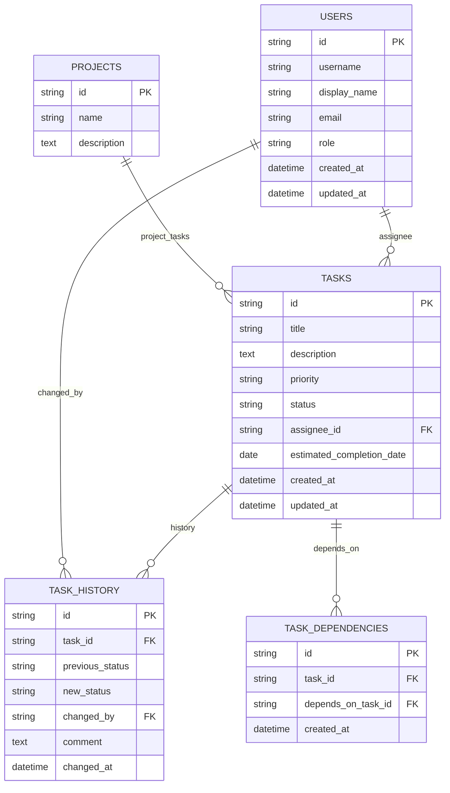

# 1. Technical Overview

This TSD describes the system architecture, data model, REST APIs, technology stack, security design, CI/CD pipeline, and operational considerations for the Intelligent Task Management System (ITMS). All technical decisions are traced back to BRD requirements (e.g., BR-F-001).

# 2. System Architecture

Architecture style: Layered microservices-style modular architecture with distinct services for authentication, user management, task management, dependency processing, and reporting. This supports BR-NF-001 (modular architecture) and BR-NF-002 (unit-testable core logic).

**High-level component diagram**

```mermaid
graph TD
  subgraph Client
    A[Web Client / SPA]
  end

  subgraph Edge
    B[API Gateway / Reverse Proxy]
  end

  subgraph Services
    C[Auth Service (Azure AD / B2C)]
    D[User Service]
    E[Task Service]
    F[Dependency Engine]
    G[Reporting Service]
  end

  subgraph Platform
    H[Azure API Management]
    I[Azure SQL Database]
    J[Azure Service Bus]
    K[Key Vault]
    L[Application Insights]
  end

  A -->|HTTPS| B
  B --> C
  B --> D
  B --> E
  E --> F
  E --> I
  D --> I
  F --> I
  E -->|events| J
  G --> I
  B --> H
  C --> K
  E --> L
  G --> L

  style C fill:#f9f,stroke:#333,stroke-width:1px
  style E fill:#ff9,stroke:#333,stroke-width:1px
  style I fill:#9f9,stroke:#333,stroke-width:1px
```

Key design decisions and rationale:
- API Gateway / Azure API Management centralizes routing, rate-limiting, and authentication enforcement (supports BR-F-005 filtering and BR-NF-003 API documentation).
- Services are split to keep business logic modular (BR-NF-001) and enable independent testing and scaling (BR-F-006 near-real-time summaries require scalable reporting).
- Azure SQL Database chosen for relational integrity and transaction support to maintain dependency integrity (BR-R-002, A4).
- Azure Service Bus supports event-driven updates (near-real-time summary updates in BR-F-006) and decouples services for scalability.

# 3. Technology Stack Recommendations

| Layer | Technology | Version / Notes | Justification (trace to BRD) |
|---|---|---:|---|
| Frontend | React (or Angular) SPA | React 18 | SPA provides responsive UI for task listing/filtering (BR-F-005) and good dev tooling. |
| API / Backend | .NET 7 (C#) or Node.js (Express/TypeScript) | .NET 7 recommended | .NET integrates well with Azure, strong typing, performance, and testability (BR-NF-001/002). Node.js is an alternative for faster iteration. |
| Auth | Azure AD / Azure AD B2C | Managed identity for services | Enterprise SSO alignment and secure token management (addresses BR-R-004 and A1). |
| Database | Azure SQL Database (managed) | Single/Elastic Pool | Relational schema, ACID transactions for dependency integrity (BR-R-002, A4). |
| Messaging | Azure Service Bus | Standard SKU | Event-driven updates for near-real-time summaries (BR-F-006). |
| Secrets | Azure Key Vault | Managed | Secure store for keys and connection strings (security section). |
| Telemetry | Azure Application Insights | - | Centralized metrics/logs/traces to meet monitoring and NFRs. |
| CI/CD | GitHub Actions or Azure DevOps Pipelines | GitHub Actions + Azure Deploy | Pipeline integrates with Azure and runs tests (BR-NF-004). |
| Infrastructure | Terraform / Bicep | IaC templates | Reproducible infra, fits DevOps patterns and Azure deployment. (BR-NF-004)

Traceability notes: Choosing Azure-managed services maps to operational constraints and aligns with assumptions about CI/CD and infra availability (A3) and persistence (A4).

# 4. Data Architecture

## ER Diagram (Mermaid)



### Core entities and attributes
- `USERS` — stores user identity and role. (BR-R-004)
- `TASKS` — primary work item with status and assignee. (BR-F-001)
- `TASK_HISTORY` — audit log for status changes (BR-F-004, BR-R-003)
- `TASK_DEPENDENCIES` — many-to-many mapping to model dependencies (BR-F-003, BR-R-002)
- `PROJECTS` — optional logical grouping for tasks (aligns with progress summaries BR-F-006)

### Data flow
- Clients call API Gateway -> Task Service to create/update tasks.
- Task Service writes tasks to Azure SQL and emits events to Service Bus on changes.
- Dependency Engine subscribes to events and re-evaluates dependent task statuses, updating Task Service/DB.
- Reporting Service aggregates data (or reads from DB) for near-real-time summaries and exposes reporting endpoints.

# 5. API Design

Base URL convention: `/api/v1`

Authentication & Authorization approach: OAuth2 / OpenID Connect with Azure AD issuing JWT access tokens. Use RBAC claims in tokens (roles: admin, project_manager, developer, viewer) to enforce BR-R-004.

Standard error response schema:
```json
{
  "error": "BadRequest",
  "message": "Detailed error message",
  "details": []
}
```

## Endpoint Catalogue

- Authentication
  - POST /api/v1/auth/token
    - Purpose: Exchange credentials / code for JWT access token (delegated to Azure AD in production).
    - Request: { grant_type, code/username/password (for dev) }
    - Response: { access_token, token_type, expires_in }
    - Trace: BR-R-004, A1

- User Management
  - GET /api/v1/users
    - Purpose: List users (filter by role)
    - Response: paginated list of `USERS`
    - Trace: BR-R-004
  - GET /api/v1/users/{id}
    - Purpose: Retrieve user details
    - Trace: BR-R-004

- Task Management
  - POST /api/v1/tasks
    - Purpose: Create task
    - Request body:
      {
        "title": "string",
        "description": "string",
        "priority": "Low|Medium|High",
        "assignee_id": "string|null",
        "estimated_completion_date": "YYYY-MM-DD",
        "project_id": "string|null"
      }
    - Response: created task object with `id`
    - Trace: BR-F-001, BR-R-001

  - GET /api/v1/tasks/{id}
    - Purpose: Retrieve task details including history and dependencies
    - Trace: BR-F-001, BR-F-004

  - PATCH /api/v1/tasks/{id}
    - Purpose: Update task fields (status, assignee, priority, etc.)
    - Request: partial task fields
    - Response: updated task
    - Trace: BR-F-004, BR-F-002

  - GET /api/v1/tasks
    - Purpose: List tasks with filtering and pagination
    - Query params: status, priority, assignee_id, due_date_from, due_date_to, q (full-text)
    - Response: paginated list and total counts
    - Trace: BR-F-005

- Task Assignment
  - POST /api/v1/tasks/{id}/assign
    - Purpose: Assign or reassign a task
    - Request: { "assignee_id": "string" }
    - Response: updated task and assignment history entry
    - Trace: BR-F-002, BR-R-004

- Task Dependencies
  - POST /api/v1/tasks/{id}/dependencies
    - Purpose: Add dependency links (list of depends_on_task_id)
    - Request: { "depends_on": ["taskId1","taskId2"] }
    - Response: updated dependency list
    - Behavior: validate against circular dependencies and return error if detected (see BR-R-002 mitigation)
    - Trace: BR-F-003, R2

  - DELETE /api/v1/tasks/{id}/dependencies/{dependencyId}
    - Purpose: Remove dependency
    - Trace: BR-F-003

- Reporting
  - GET /api/v1/reports/project-summary?project_id={id}
    - Purpose: Return counts by status and key metrics (Total, Completed, In Progress, Blocked, Pending)
    - Response: { total, completed, in_progress, blocked, pending, last_updated }
    - SLA: updated within 60s of changes (BR-F-006)
    - Trace: BR-F-006

  - GET /api/v1/reports/tasks-overdue?project_id={id}
    - Purpose: List overdue tasks
    - Trace: BO-003, BR-F-006

Notes:
- All endpoints must return standard error schema and use pagination for listing endpoints (BR-F-005).
- OpenAPI spec must be produced as part of implementation (BR-NF-003).

# 6. Security Architecture

Goals: Protect confidentiality, integrity, and availability of user data while addressing OWASP Top 10.

Authentication & Authorization
- Use Azure AD / Azure AD B2C for user auth and issue JWT tokens for API access. Enforce audience, issuer, and signature validation.
- Use RBAC/claims for fine-grained authorization: roles and project-scoped permissions (BR-R-004).

Secrets & Keys
- Store all credentials and secrets in Azure Key Vault. Use managed identities for service-to-service auth when running in Azure.

Transport & Encryption
- Enforce TLS 1.2+ for all networks. Use HSTS and secure cookie flags.

OWASP Top 10 mitigations (mapped)
- A1 - Injection: Use parameterized queries/ORM (e.g., Entity Framework, Dapper with parameters) and input validation. (Maps to BR-R-003 auditability and BR-F-001 validation requirements)
- A2 - Broken Authentication: Delegate auth to Azure AD; rotate keys in Key Vault; enforce short-lived tokens.
- A3 - Sensitive Data Exposure: Encrypt data at rest (Azure SQL transparent data encryption) and in transit (TLS). Do not log secrets.
- A4 - XML External Entities (XXE): Use JSON-based APIs and secure XML parsers when necessary.
- A5 - Broken Access Control: Enforce RBAC with least privilege; validate server-side permissions for all operations (BR-R-004).
- A6 - Security Misconfiguration: Harden images, use secure defaults, scan container images and IaC templates.
- A7 - Cross-Site Scripting (XSS): Escape/encode user input in UI; use Content Security Policy (CSP).
- A8 - Insecure Deserialization: Avoid unsafe deserialization; validate inputs and use safe libraries.
- A9 - Using Components with Known Vulnerabilities: Dependabot or similar for dependency scanning; run SCA in CI.
- A10 - Insufficient Logging & Monitoring: Centralized logs in Application Insights; alerting on suspicious activity; ensure logs include correlation IDs but not PII.

Additional controls:
- Rate limiting at API Gateway to mitigate abuse.
- WAF (Azure Front Door or Application Gateway with WAF) for further edge protection.
- Regular vulnerability scanning and scheduled penetration testing.

# 7. Integration Points

- Identity Provider: Azure AD / B2C (A1)
- Notifications/events: Webhooks or Service Bus to integrate with downstream channels (A2)
- CI/CD: GitHub Actions / Azure DevOps (BR-NF-004)

# 8. Infrastructure & Deployment Architecture

Target environment: Microsoft Azure (subscription per environment: dev/stage/prod).

Container strategy:
- Build stateless services as containers.
- Use Azure Kubernetes Service (AKS) for orchestration when multi-service scaling required; App Service for small deployments.

IaC and environment promotion:
- Use Terraform or Bicep to provision resources (AKS, Azure SQL, Service Bus, Key Vault, App Insights).
- Environments: dev -> stage -> prod with IaC-driven deployments.

CI/CD pipeline (high-level): described in Section 10.

# 9. Performance & Scalability Design

- Read endpoints use indexing on `tasks.status`, `tasks.assignee_id`, and `tasks.estimated_completion_date` to satisfy BR-NF-005 performance goals.
- Use pagination and query limits for large result sets (BR-F-005).
- Offload heavy aggregation to Reporting Service and use caching (Azure Cache for Redis) where required for sub-60s summary freshness (BR-F-006).
- Horizontal scaling: scale Task and Reporting services independently using AKS or App Service Plan autoscale based on CPU/queue length.

# 10. CI/CD Pipeline Architecture

Pipeline stages (GitHub Actions or Azure DevOps):
- PR Validation (on pull_request):
  - Checkout code
  - Static analysis / lint
  - Build
  - Unit tests (must cover core business logic per BR-NF-002)
  - SCA and security scans (Snyk/Dependabot)
  - Publish test artifacts
- Merge to main (protected branch):
  - Run integration tests
  - Build container images
  - Push images to Azure Container Registry (ACR)
  - Terraform plan (review) and apply in target environment (with approvals)
  - Deploy to staging (AKS/App Service)
  - Run smoke tests
  - Promote to production via controlled release (manual approval)

Trace: Enforces BR-NF-002 (tests) and BR-NF-004 (CI pipeline).

# 11. Technical Risks & Mitigations

- TR-001: Circular dependency logic introduces inconsistent states.
  - Mitigation: Validate dependencies on creation; implement DAG checks and QA test cases (maps to R2).

- TR-002: Slow aggregation for large data sets.
  - Mitigation: Add reporting denormalized aggregates, use caching and background workers; scale reporting service.

- TR-003: Misconfiguration of RBAC allowing unauthorized assignment.
  - Mitigation: Policy-as-code checks; enforce role checks in tests and CI; require code review for auth changes (maps to BR-R-004).

# 12. Traceability — Mapping Technical Decisions to BRD Requirements

- Modular services and unit tests: BR-NF-001, BR-NF-002
- API documentation (OpenAPI): BR-NF-003
- Task schema (TASKS, TASK_HISTORY, TASK_DEPENDENCIES): BR-F-001, BR-F-004, BR-F-003, BR-R-001, BR-R-003
- Dependency Engine and Service Bus for near-real-time summaries: BR-F-006
- Authorization via Azure AD and RBAC claims: BR-R-004
- CI/CD pipeline stages and test enforcement: BR-NF-004, BR-NF-002
- Use of Azure managed services (Azure SQL, Service Bus, Key Vault): A3, A4 and operational reliability for production (maps to overall availability and security requirements)

---

Revision History

- 1.0 — 2026-06-03 — Initial TSD created from `doc/brd.md` and `requirement.md`.
